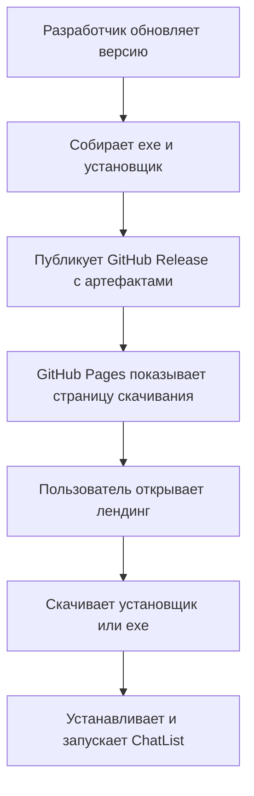

## 1. Обзор продукта
Нужно подготовить понятную и воспроизводимую публикацию настольного приложения `ChatList` через `GitHub Release` и `GitHub Pages`.
- Цель: упростить распространение установщика, дать пользователю понятную страницу скачивания и сократить ручные действия при выпуске новых версий.
- Ценность: репозиторий получает единый публичный канал дистрибуции, а пользователи получают страницу продукта, релиз-артефакты и понятную инструкцию по установке.

## 2. Основные функции

### 2.1 Функциональные модули
1. **GitHub Release**: публикация релизов, загрузка `exe` и установщика, шаблон релизных заметок.
2. **GitHub Pages лендинг**: одностраничный сайт продукта с описанием, кнопками скачивания и инструкцией.
3. **Документация публикации**: пошаговая инструкция по выпуску новой версии, чек-лист перед публикацией и структура артефактов.
4. **Шаблоны CI/CD**: workflow-файлы для автоматизации публикации сайта и, при желании, релизных артефактов.

### 2.2 Детализация страниц и материалов
| Имя страницы/файла | Модуль | Описание функции |
|---|---|---|
| Лендинг GitHub Pages | Hero-блок | Показывает название приложения, версию, краткое описание и CTA на скачивание |
| Лендинг GitHub Pages | Блок преимуществ | Объясняет, зачем нужен `ChatList`, какие сценарии он решает |
| Лендинг GitHub Pages | Блок загрузки | Даёт ссылки на `GitHub Release`, установщик и portable/exe вариант |
| Лендинг GitHub Pages | Блок установки | Пошагово описывает установку и размещение `.env.local` |
| Лендинг GitHub Pages | Блок выпуска | Даёт краткую памятку для разработчика по публикации новой версии |
| Release-шаблоны | Release notes | Содержат структуру заметок к релизу: изменения, исправления, known issues |
| Workflow-файлы | Pages deploy | Автоматически публикуют статический сайт на `GitHub Pages` |
| Workflow-файлы | Release publish | Помогают стандартизировать выкладку артефактов в `GitHub Release` |

## 3. Основной процесс
Разработчик обновляет версию, собирает `exe` и установщик, публикует release в GitHub, а лендинг на `GitHub Pages` автоматически или вручную обновляется ссылками на актуальный релиз. Пользователь заходит на лендинг, читает описание, скачивает установщик и следует краткой инструкции по запуску.

## 4. Дизайн интерфейса
### 4.1 Стиль
- Основной цвет: тёмно-зелёный, связанный с текущим брендингом иконки приложения
- Акцент: светло-зелёный для кнопок скачивания и статусов релиза
- Стиль кнопок: крупные, слегка скруглённые, контрастные
- Шрифты: системные веб-безопасные шрифты без внешних зависимостей
- Макет: desktop-first, одностраничный, с чёткими секциями и якорной навигацией
- Визуальный тон: практичный, чистый, технический, без перегруженности

### 4.2 Обзор секций лендинга
| Имя страницы | Модуль | UI-элементы |
|---|---|---|
| Главная | Hero | Название, версия, слоган, кнопки `Скачать установщик` и `Открыть Release` |
| Главная | Преимущества | Карточки или список основных возможностей приложения |
| Главная | Как установить | Пошаговая инструкция, код-блоки, подсказка по `.env.local` |
| Главная | Для разработчика | Краткая схема релизного процесса и ссылки на GitHub |
| Главная | Footer | Версия, ссылка на репозиторий, лицензия/автор |

### 4.3 Адаптивность
- Базовый режим: desktop-first
- Мобильная адаптация: одна колонка, кнопки на всю ширину, упрощённые отступы
- Поддержка узких экранов: читабельные блоки с переносом длинных ссылок и команд

