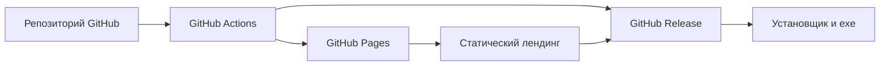
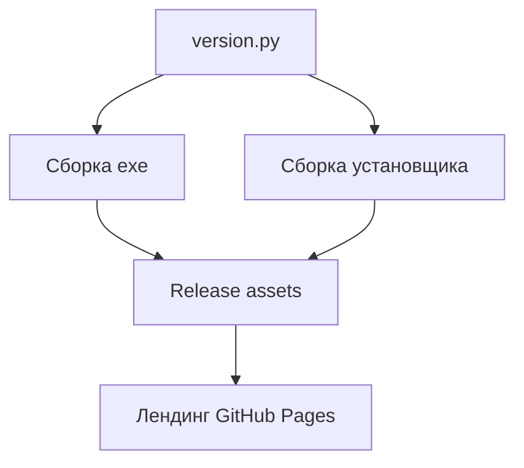

## 1. Архитектура решения

## 2. Технологии
- Фронтенд лендинга: статический `HTML5 + CSS3 + Vanilla JavaScript`
- Хостинг сайта: `GitHub Pages`
- Автоматизация: `GitHub Actions`
- Источник версии: `version.py`
- Источник артефактов: `release/` и/или assets в `GitHub Release`

## 3. Структура маршрутов и файлов
| Путь | Назначение |
|---|---|
| `/` | Лендинг приложения для `GitHub Pages` |
| `/assets/` | Иконки, изображения и вспомогательные стили/скрипты для лендинга |
| `.github/workflows/pages.yml` | Публикация сайта на `GitHub Pages` |
| `.github/workflows/release.yml` | Шаблон автоматизации публикации релизных артефактов |
| `docs/index.html` или `site/index.html` | Основная HTML-страница лендинга |
| `RELEASE_CHECKLIST.md` | Пошаговый чек-лист выпуска версии |
| `RELEASE_TEMPLATE.md` | Шаблон заметок к релизу |

## 4. API и внешние сервисы
- Backend не требуется
- Внешние сервисы:
  - `GitHub Releases` для хранения бинарных файлов
  - `GitHub Pages` для публикации лендинга

## 5. Модель данных
### 5.1 Логическая модель

### 5.2 Конвенции публикации
- Имя установщика: `ChatListApp_Setup_<версия>.exe`
- Имя exe: `ChatListApp.exe`
- Версия отображается:
  - в приложении
  - в логах
  - в версии файла `exe`
  - на лендинге
  - в release notes

## 6. Технические решения
- Лендинг делается статическим без сборщика, чтобы публикация на `GitHub Pages` была максимально простой.
- Для `GitHub Pages` рекомендуется использовать каталог `docs/`, чтобы можно было включить публикацию прямо из ветки `main`.
- Ссылки на релизные артефакты формируются либо вручную через шаблон, либо автоматически через подстановку версии.
- Страница должна содержать:
  - кнопку скачивания последнего установщика
  - ссылку на страницу всех релизов
  - краткую инструкцию по установке
  - секцию для разработчика с шагами публикации
- `release.yml` готовится как шаблон с ручным запуском (`workflow_dispatch`) и местом для загрузки артефактов, чтобы не ломать текущий процесс сборки.

